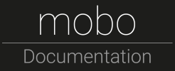

    

## About mobo
[Mobo](https://www.npmjs.com/package/mobo) is a command line toolset that helps to build [Semantic MediaWiki](http://semantic-mediawiki.org/) structure in an agile,
Schema-Driven Development (simplified MDE) way.
The model is written in [YAML](http://yaml.org/)/[JSON](http://json.org/), using object oriented [JSON Schema](http://json-schema.org/).

Since the model is organized in folders and plain text files, an editor of choice and Version Control Systems like Git can be used.
There is no need of additional tooling.

The main feature of mobo is the model development workflow.
Semantic MediaWikis can be developed rapidly and modular, leading to a more agile development process.
Mobo can run in an interactive mode, automatically validating and uploading the model in realtime.

Mobo also features a web application for inspecting the development model in its various stages.

Mobo can also be used to batch-import wiki pages or data (programmatically).

Mobo is [Open Source](https://github.com/Fannon/mobo) and Cross-Platform.

## Documentation
* Read the [documentation online](http://fannon.gitbooks.io/mobo-documentation/content/)
* Download the documentation at [GitBook](https://www.gitbook.com/book/fannon/mobo-documentation)

## Screenshots
The mobo model is developed with your favorite text editor:

----------------------------------------------------------------

Mobo is a console application. It validates, generates and uploads your model in realtime:

----------------------------------------------------------------

There is a webapp that allows you to browse your development model and the resulting wikitext:

----------------------------------------------------------------

Mobo can generate a graph (which has to be layouted via Gephi) that can be explored in an interactive application:

----------------------------------------------------------------

The final result in the wiki:

